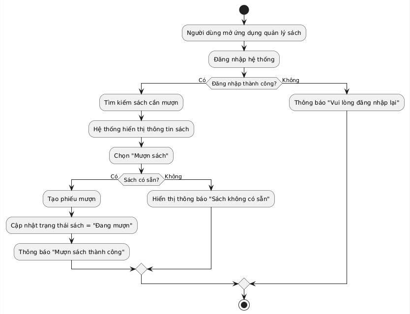
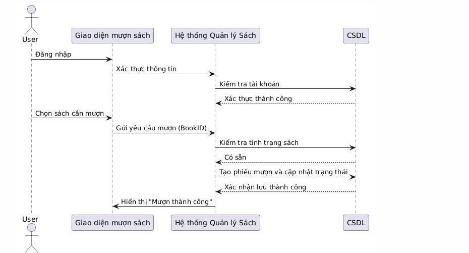

# 📘 Lab 03 – UML Thiết kế (Use Case & Sequence Diagram)

## 🎯 Mục tiêu
Sinh viên mô tả luồng tương tác chi tiết của hệ thống thông qua **Use Case Diagram** và **Sequence Diagram**, dựa trên **Mini Project: Quản lý Sách**.

---

## 🧩 1. Mô tả quy trình nghiệp vụ: Mượn sách

### 🧠 Mục tiêu
Cho phép **người dùng** mượn sách nếu sách còn sẵn trong hệ thống.

### 👥 Các tác nhân tham gia
| Tác nhân | Mô tả vai trò |
|-----------|----------------|
| **Người dùng (User)** | Thực hiện thao tác đăng nhập, tìm và mượn sách. |
| **Hệ thống (Library System)** | Kiểm tra trạng thái sách, tạo phiếu mượn và phản hồi kết quả. |
| **Cơ sở dữ liệu (Database)** | Lưu trữ thông tin sách, tình trạng sách và phiếu mượn. |

---

## 🔁 2. Phân tích luồng nghiệp vụ

### 🔸 Luồng chính:
1. Người dùng đăng nhập vào hệ thống.  
2. Người dùng tìm kiếm sách muốn mượn.  
3. Hệ thống hiển thị thông tin sách.  
4. Người dùng chọn "Mượn sách".  
5. Hệ thống kiểm tra tình trạng sách trong cơ sở dữ liệu.  
6. Nếu sách còn → hệ thống tạo phiếu mượn và cập nhật trạng thái sách.  
7. Thông báo “Mượn sách thành công”.

### ⚠️ Luồng thay thế (ngoại lệ):
- Nếu **sách không còn** → hiển thị thông báo “Sách không có sẵn”.  
- Nếu **người dùng chưa đăng nhập** → yêu cầu đăng nhập lại.

---

## 🧭 3. Activity Diagram

### 🖼️ Hình minh họa

*(Biểu đồ mô tả các bước xử lý khi người dùng mượn sách.)*

---

## 🎭 4. Use Case Diagram

### 🖼️ Hình minh họa

*(Biểu đồ thể hiện chức năng chính và mối quan hệ giữa tác nhân và hệ thống.)*

---

## 📈 5. Sequence Diagram – Quy trình “Mượn sách”

### 🖼️ Hình minh họa

*(Mô tả quá trình tương tác giữa người dùng, hệ thống và cơ sở dữ liệu khi thực hiện mượn sách.)*

---

