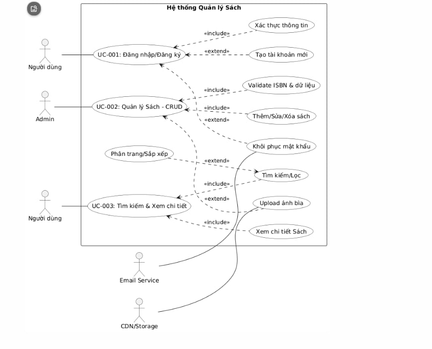
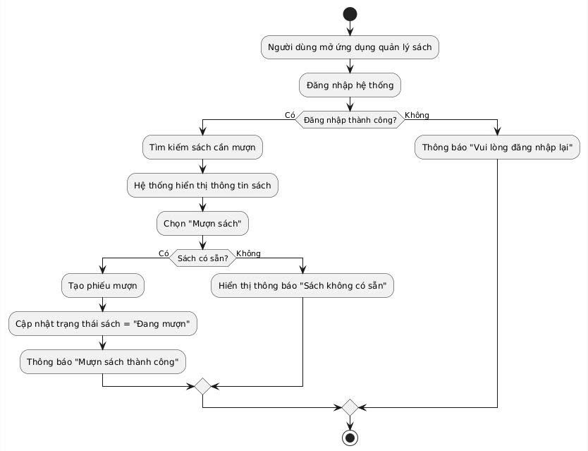
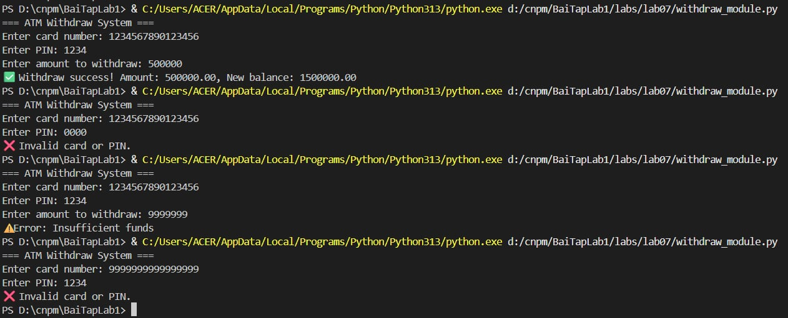

# 📘 Final Report – Mini Project Quản Lý Sách

## 1. Giới thiệu
Dự án **Mini Project Quản lý Sách** được xây dựng nhằm tổng hợp toàn bộ kiến thức từ Lab 01 → Lab 09.  
Các chức năng chính bao gồm: đăng nhập, mượn/trả sách, quản lý dữ liệu sách và báo cáo tiến độ bằng Jira.

---

## 2. Mô hình UML

### 2.1 Use Case Diagram (Lab 02)
- Use Case: Đăng nhập/Đăng ký  
- Tác nhân: Người dùng, Hệ thống  
- Kết quả: Người dùng đăng nhập thành công để sử dụng hệ thống.



### 2.2 Sequence Diagram (Lab 03)
- Quy trình nghiệp vụ: **Mượn sách**  
- Các bước: Người dùng → Gửi yêu cầu mượn → Hệ thống kiểm tra sách → Trả kết quả.


### 2.3 Class Diagram (Lab 06)
Mô hình lớp thể hiện các đối tượng: **User, Book, Borrow, Database**.


---

## 3. Database & Code Minh Họa

### 3.1 ERD (Lab 05)


### 3.2 Script Database (Lab 07)
```sql
-- File: atm_demo.sql
-- Cấu trúc bảng ví dụ từ Lab 07
CREATE TABLE Books (
    BookID INT PRIMARY KEY,
    Title VARCHAR(100),
    Author VARCHAR(100),
    Status VARCHAR(20)
);
```

### 3.3 Form Login (Lab 04)
```html
<!-- index.html -->
<form>
  <label>Username</label>
  <input type="text" name="username">
  <label>Password</label>
  <input type="password" name="password">
  <button type="submit">Login</button>
</form>
```

### 3.4 Module Withdraw/Mượn Sách (Lab 07)
```python
# withdraw_module.py
def withdraw_book(book_id, user_id):
    # logic kiểm tra và trừ số lượng sách
    pass
```

---

## 4. Kết quả Test & Jira Report

### 4.1 Test (Lab 08)
Kết quả test tự động (Selenium + Pytest).  
Báo cáo HTML: `test_report.html`  


### 4.2 Jira Report (Lab 09)
Quản lý sprint và backlog trên Jira.  


---

## 5. Kết luận & Định hướng mở rộng
- Hoàn thiện quy trình phát triển: từ phân tích → thiết kế UML → database → code → test → quản lý dự án.  
- Mở rộng:  
  - Thêm tính năng trả sách, tìm kiếm nâng cao.  
  - Tích hợp API cho mobile app.  
  - Cải thiện UI/UX.  

---

## 6. Tài liệu & Repo
- Repo GitHub: *(thêm link repo của bạn)*  
- Slide PPTX: *(đính kèm nếu có)*  
